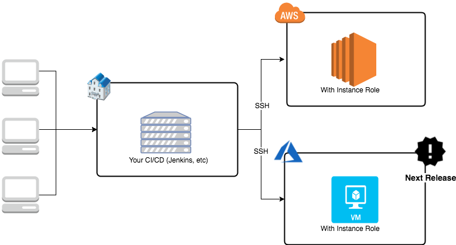

# OS Factory
OSFactory is an image creation framework (OS) based on Packer and Ansible and is currently used within the Société Générale for the creation of all the images used on the Public Cloud.

## How to install it

Please run this command to install all dependencies.

``` ansible-playbook resource/dependencies/aws.install.yml -i "MY_IP," ```

## Dependencies
### For infrastructure


To create images on AWS, the EC2 instance must be created in the same location (same subnet and region) as the one where packer will start creating your image.

### For project
- [ansible](https://www.ansible.com/)>= 2.4
- [awscli](https://aws.amazon.com/en/cli/)
- [boto3](https://github.com/boto/boto3)
- [boto](https://github.com/boto/boto)
- [packer](https://www.packer.io/)

## License

[Apache 2.0](LICENSE)

## Author Information

This project has been created in 2017 by [Maxence Maireaux](https://github.com/Flemzord/) and Product Owner by [Yannick Neff](https://github.com/yannickneff).

## Contributor
- [Aurélien Maury (WeScale)](https://github.com/aurelienmaury)
- [Etienne Deneuve (Cellenza)](https://github.com/EtienneDeneuve)
- [Xavier Bloumine (Aneo)](https://github.com/BloumineX)

## Sponsorship
[](https://www.societegenerale.fr/)&nbsp;&nbsp;&nbsp;
[](https://www.microsoft.com/)&nbsp;&nbsp;&nbsp;
[](http://www.wescale.fr/)&nbsp;&nbsp;&nbsp;
[](http://www.cellenza.com/)
